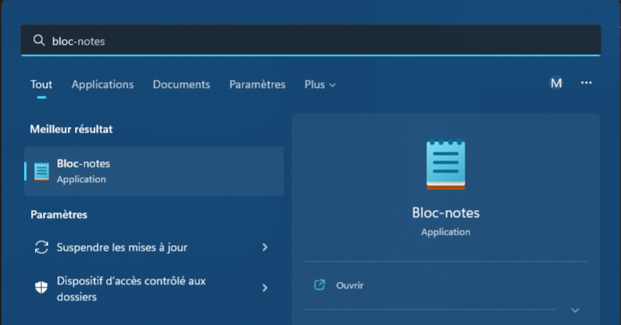

# Avant d'apprendre à programmer
Avant de rentrer dans le coeur du sujet, à savoir, la programmation, je vous propose d'abord d'apprendre 

L'objectif de ce premier book est de vous apprendre les bases nécessaires à la compréhension de votre machine et de vous faire mettre en pratique ceci en créant votre premier fichier texte contenant du code c++.

Ici, seules les informations dont vous avez besoin pour comprendre le cours sont introduites. Cependant, il existe des cours beaucoup plus adaptés pour apprendre la théorie de Bool, les mathématiques logiques etc.

Si vous n'êtes pas familiés avec l'informatique, les notions introduites dans ce premier book risquent d'être compliqués à comprendre. Je vous invite à le lire tout de même, à en prendre connaissance et à ne pas vous arrêter sur les détails que vous ne comprenez pas. Ayez confiance en votre cerveau, il va cogiter dessus et plus tard, avec l'expérience, tout va se lier tout seul. :D 

# Qu'est-ce qu'un octet ?
Un bit est une unité d'information pouvant prendre la valeur 0 ou 1. 
En décimale, chaque chiffre nous permet de compter de 0 à 9. 
En binaire, les unités sont des bits et nous permettent de compter de 0 à 1.
En décimale, les nombres sont composés de chiffres et permettent de compter au-delà de 10.
En binaire, les octets sont composés de huits bits et permettent de compter au-delà de 1.

Ainsi, il est possible de compter avec des octets de 0 à 10 par exemple : 
- 0 en décimale = 00000000 en binaire
- 1 en décimale = 00000001 en binaire
- 2 en décimale = 00000010 en binaire
- 3 en décimale = 00000011 en binaire
- 4 en décimale = 00000100 en binaire
- 5 en décimale = 00000101 en binaire
- 6 en décimale = 00000110 en binaire
- 7 en décimale = 00000111 en binaire
- 8 en décimale = 00001000 en binaire
- 9 en décimale = 00001001 en binaire
- 10 en décimale = 00001010 en binaire

Un octet peut contenir des valeurs comprises en 0 et 255 (28-1).

# Comment représenter un texte avec des octets ?

Nous allons maintenant introduire la notion de représentation d'un texte par des octets. Cette notion est assez avancée et difficile à comprendre mais elle me paraît importe à introduire pour mieux appréhender les différents types de fichiers qu'il vous est possible de rencontrer dans un ordinateur.

Le caractère est l'unité du texte. 
Il peut être une lettre minuscule (e.g. 'a'), une lettre majuscule (e.g. 'A') ou un caractère spécial (e.g. ',').
Une suite d'octets peut être utilisée pour représenter un texte.
Chaque octet a une valeur qui lui est attribuée (e.g. 01000001) et chaque valeur correspond à un caractère (e.g. 'A'). 

En suivant ce principe, des programmes utilisent ce que nous nommons la table ASCII. 
À chaque nombre est associé un caractère. 
Exemple,  le "A" (majuscule) est associé au nombre 65. 
Ainsi, chaque octet contient un caractère (possiblement une lettre) et une suite de ces octets permet d'écrire un texte. Pour écrire le mot "BONJOUR", en majuscule, il vous faut donc les octets suivants : 
- B = 66 en décimale = 01000010
- O = 79 en décimale = 01001111
- N = 78 en décimale = 01001110
- J = 74 en décimale = 01001010
- O = 79 en décimale = 01001111
- U = 85 en décimale = 01010101
- R = 82 en décimale = 01010010

Ci-dessous, un apperçu de la table ASCII en question : 

| Caractère | Nombre Décimal | Binaire (sur un octet) |
|:---------|:--------:|---------:|
| A | 65 | 01000001 |
| B | 66 | 01000010 |
| C | 67 | 01000011 |
| D | 66 | 01000100 |
| E | 67 | 01000101 |
| F | 68 | 01000110 |
| G | 69 | 01000111 |
| H | 70 | 01001000 |
| I | 65 | 01001001 |
| J | 65 | 01001010 |

Imaginons maintenant que je vous donne un texte sous forme d'octets. Je vais vous aider, je sépare chaque octet par un espace pour rendre le texte plus lisible :  01001010 00100111 01000001 01000000 01000110 01000001 01001001 01001101

Notez que nous nommons cela une chaine de caractère, nous reviendrons plus tard sur ce principe.

Il ne vous est pas évident de lire le mot que je viens de vous écrire en binaire.
Pour rendre ces chaines de caractères plus faciles à lire, les machines les affichent sous forme de texte.
Ainsi, nous dissocions deux types de fichiers : les fichiers binaires qui n'ont pas pour objectif d'être lus par des utilisateurs (humains) et les fichiers texte.

# Les différents types de fichiers
Nous pouvons discerner deux types de fichiers sur les ordinateurs. 
Les fichiers texte et les fichiers binaire.

Le fichier binaire contient un ensemble d'octets dans lesquels des valeurs sont stockées. 
Le fichier tel quel ne peut être lu par un humain. 
Un programme peut cependant lire un fichier binaire pour charger la carte d'un jeu vidéo par exemple.

Ces valeurs peuvent permettre de décrire une carte, la sauvegarde d'un jeu vidéo, un enregistrement audio, des images etc.
Ces informations contenant certaines valeurs qui peuvent servir à différentes choses. 
[Exemple de programme]
[Exemple de fichier word]
[Autre exemple ?]

Le fichier texte est un cas particulier du fichier binaire et, comme son nom l'indique, contient une suite de caractères (a, b, c, à, 0, 7 etc ...) qui forme un texte. 
Un programmeur écrit généralement son code dans un fichier texte.
[Exemple de fichier texte de bloc note]
[Exemple de fichier texte de programme C++]
[Exemple de fichier texte de html d'un site]
[Exemple de fichier texte compliqué à comprender ?]

Quelques exemples de fichiers binaires. Comme vous pouvez le constater, les fichiers word sont en fait des fichiers binaires qui, une fois interprétés par la machine, permettent d'afficher du texte. 
Les premières fois, c'est un peu casse-tête mais ne vous inquiétez pas, vous finirez pas comprendre. :D 

# Apprendre à écrire un fichier texte

# Différence entre un fichier Word (ou ) et un fichier texte

