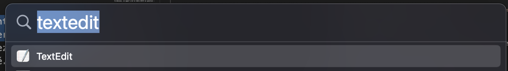

# Avant d'apprendre à programmer
<p align="justify"> 
Avant de rentrer dans le coeur du sujet, à savoir, la programmation, je vous propose d'abord d'apprendre 
</p>

<p align="justify"> 
L'objectif de ce premier book est de vous apprendre les bases nécessaires à la compréhension de votre machine et de vous faire mettre en pratique ceci en créant votre premier fichier texte contenant du code c++.
</p>

<p align="justify"> 
Ici, seules les informations dont vous avez besoin pour comprendre le cours sont introduites. Cependant, il existe des cours beaucoup plus adaptés pour apprendre la théorie de Bool, les mathématiques logiques etc.
</p>

<p align="justify"> 
Si vous n'êtes pas familiés avec l'informatique, les notions introduites dans ce premier book risquent d'être compliqués à comprendre. Je vous invite à le lire tout de même, à en prendre connaissance et à ne pas vous arrêter sur les détails que vous ne comprenez pas. Ayez confiance en votre cerveau, il va cogiter dessus et plus tard, avec l'expérience, tout va se lier tout seul. :D 
</p>

TODO: Ajouter un sommaire ici pour facilement se balader dans le contenu de ce book.

# Qu'est-ce qu'un octet ?
<p align="justify"> 
En décimale, chaque chiffre nous permet de compter de 0 à 9. Les nombres décimaux sont composés de chiffres et permettent de compter au-delà de 10.
En binaire, les unités sont des bits et nous permettent de compter de 0 à 1. Les octets sont composés de huits bits et permettent de compter au-delà de 1.
</p>

Ainsi, il est par exemple possible de compter avec des octets de 0 à 10 de la manière suivante : 
- 0 en décimale = 00000000 en binaire
- 1 en décimale = 00000001 en binaire
- 2 en décimale = 00000010 en binaire
- 3 en décimale = 00000011 en binaire
- 4 en décimale = 00000100 en binaire
- 5 en décimale = 00000101 en binaire
- 6 en décimale = 00000110 en binaire
- 7 en décimale = 00000111 en binaire
- 8 en décimale = 00001000 en binaire
- 9 en décimale = 00001001 en binaire
- 10 en décimale = 00001010 en binaire 


Un octet peut contenir des valeurs comprises en 0 et 255 (2<sup>8</sup>-1).


# Comment représenter un texte avec des octets ?

<p align="justify"> 
Nous allons maintenant introduire la notion de représentation d'un texte par des octets. Cette notion est assez avancée et difficile à comprendre mais elle me paraît importe à introduire pour mieux appréhender les différents types de fichiers qu'il vous est possible de rencontrer dans un ordinateur.  
</p>


<p align="justify"> 
Le caractère est une lettre ou un signe servant à la composition des textes. En informatique, un caractère peut prendre la forme d'une lettre minuscule (e.g. 'a'), d'une lettre majuscule (e.g. 'A') ou d'un caractère spécial (e.g. ',').
Une suite d'octets peut être utilisée pour représenter un texte.
Chaque octet encode un nombre (e.g. 01000001) et chaque nombre est associé à un caractère (e.g. 'A'). 
</p>


<p align="justify"> 
En suivant ce principe, des programmes utilisent ce que nous nommons la table ASCII. 
À chaque nombre est associé un caractère. 
Exemple,  le "A" (majuscule) est associé au nombre 65. 
Ainsi, chaque octet contient un caractère (possiblement une lettre) et une suite de ces octets permet d'écrire un texte. Pour écrire le mot "BONJOUR", en majuscule, il vous faut donc les octets suivants : 
</p>

- B = 66 en décimale = 01000010
- O = 79 en décimale = 01001111
- N = 78 en décimale = 01001110
- J = 74 en décimale = 01001010
- O = 79 en décimale = 01001111
- U = 85 en décimale = 01010101
- R = 82 en décimale = 01010010


Ci-dessous, un apperçu de la table ASCII en question : 

| Caractère | Nombre Décimal | Binaire (sur un octet) |
|:---------|:--------:|---------:|
| A | 65 | 01000001 |
| B | 66 | 01000010 |
| C | 67 | 01000011 |
| D | 66 | 01000100 |
| E | 67 | 01000101 |
| F | 68 | 01000110 |
| G | 69 | 01000111 |
| H | 70 | 01001000 |
| I | 65 | 01001001 |
| J | 65 | 01001010 |

<p align="justify"> 
Imaginons maintenant que je vous donne un texte sous forme d'octets. Je vais vous aider, je sépare chaque octet par un espace pour rendre le texte plus lisible :  
</p>

```01001010 00100111 01000001 01000000 01000110 01000001 01001001 01001101```

<p align="justify"> 
Notez que nous nommons cela une chaine de caractères, nous reviendrons dans quelques chapitres sur cette définition.
</p>

<p align="justify"> 
Il ne vous est pas évident de lire le mot que je viens de vous écrire en binaire.
Pour rendre ces chaines de caractères plus faciles à lire, les machines les affichent sous forme de texte. Dans la suite de ce *book*, nous allons introduire les fichiers binaires – qui n'ont pas pour objectif d'être lus par des utilisateurs (humains) – et texte.
</p>


# Les fichiers binaires et texte

<p align="justify"> 
Nous pouvons discerner deux types de fichiers sur les ordinateurs. 
Les fichiers texte et les fichiers binaires.
</p>

<p align="justify"> 
Le **fichier binaire** contient un ensemble d'octets dans lesquels des valeurs sont stockées. 
Le fichier tel quel ne peut être lu par un humain. 
Un programme peut cependant lire un fichier binaire pour charger la carte d'un jeu vidéo par exemple. L'image ci-dessous vous montre le contenu d'un fichier son affiché sous la forme d'un texte : 
</p>

<p align="center"></p>

<p align="justify"> 
Le contenu de ce fichier n'étant pas du texte, il nous est impossible d'interpréter son contenu à partir de son affichage textuel.
</a>

<p align="justify"> 
Le **fichier texte** est un cas particulier du fichier binaire et, comme son nom l'indique, contient une suite de caractères (a, b, c, à, 0, 7 etc ...) qui forme un texte. Un programmeur écrit généralement son code dans un fichier texte. Par exemple, j'écris ce cours en markdown comme illustré ci-dessous : 
</p>

<p align="center"></p>

<p align="justify"> 
Les étoiles sont un élément de syntaxe qui permet au programme de comprendre que le texte doit être mis en gras. D'autres éléments syntaxes existent et peuvent être utilisés pour agrémenter le texte. Vous noterez aussi que le contenu du fichier, dont les éléments de syntaxe, est un texte et qu'il est facile à lire.
</p>


# Apprendre à écrire un fichier texte

Passons à la pratique ! Pour apprendre à programmer, vous allez devoir écrire votre premier fichier contenant du code C++. Puisque tout le monde n'utilise pas le même système d'opération, je vous propose ci-dessous une version pour celles et ceux qui utilisent Windows, une autre pour Mac OS et une pour Linux.

## Sur Windows
Sur votre ordinateur, cherchez d'abord le programme bloc-note pour écrire votre fichier.

<p align="center"></p>

Maintenant, copiez et collez le code ci-dessous dans le bloc note.

Puis, enregistrer le fichier. **Attention**, lorsque vous enregistrez, précisez bien que l'extension n'est pas *.txt* en choisissant  


## Sur Mac OS

### Ouvrir d'abord TextEdit
Pour créer un fichier texte contenant votre code C++ sur Mac OS, vous devez d'abord lancer TextEdit. Pour cela, appuyez sur ⌘+espace et écrivez TextEdit dans la barre de recherche qui s'est affiché. Puis, appuyez sur entrer.
<p align="center"></p>

### Créer un fichier texte
Le format par défaut de TextEdit est le format de texte enrichi – un peu l'équivalent des docx de Word. Vous pouvez changer cela en allant dans TextEdit -> Réglages et en sélectionnant Format Texte. Ensuitez, créez un nouveau fichier en appuyant sur ⌘+N ou en allant dans Fichier -> Nouveau.

<p align="center"></p>


### Enregistrer le fichier texte
Pour finir, vous pouvez enregistrer votre fichier en appuyant sur ⌘+S ou en allant dans Fichier -> Enregistrer. Entrez d'abord un nom de fichier finissant par ".cpp" tel que "monfichier.cpp". Décochez la case avec écrit "Utiliser « .txt » à défaut d'extension".

<p align="center"></p>

## Sur Linux


# Mais les fichiers Word c'est des fichiers texte ? 
<p align="justify"> 
Et bien non ! Si j'en parle ici, c'est parce que j'ai déjà vu des étudiants essayer de coder depuis "Word". Cela en fera rire certains. Pour ma part, je trouve ça intéressant. Le principe de fichier texte n'est pas forcément évident à appréhender la première fois et non, Word n'enregistre pas vos fichiers ua format texte. 
</p>

<p align="justify"> 
En effet, les fichiers Word sont des fichiers binaires qui sont interprétés par le logiciel de manière à les rendre compréhensibles pour l'oeil humain. Cependant, la matière première, le fichier sauvegardé, est bien un fichier binaire. Ne vous y trompez pas. 
</p>

<p align="justify"> 
Ci-dessous, vous trouverez un exemple de fichier au format docx, le format word. Ce fichier est disponible dans le sous-dossier "files" de ce répertoire. La partie supérieure de l'image montre le contenu textuel du fichier tandis que l'image inférieure montre le fichier tel que LibreOffice Writer le montre.
</p>

<p align="center"></p>

<p align="justify">Vous pouvez constater que la partie supérieure n'est pas compréhensible. A contrario, vous n'avez aucun problème à lire le texte présent dans la partie inférieure. Dans le cas d'un fichier texte, vous n'auriez eu aucun problème à lire le fichier d'origine. </p>


# La différence entre un logiciel de traitement de texte et un éditeur de texte

# La terminologie à comprendre : 

- **Bit :** une unité d'information pouvant prendre la valeur 0 ou 1.
- **Octet :** une suite de 8 bits. L'octet peut représenter des valeurs allant de 0 à 255.
- **Chiffre :** l'unité d'information pouvant prendre la valeur 0, 1, 2, 3, 4, 5, 6, 7, 8 ou 9.
- **Nombre Décimal :** est composé de plusieurs chiffres et permet de compter au delà de 9.
- **Caractère :** l'unité d'information d'un texte. Un caractère peut être une lettre minuscule (e.g. 'a'), une lettre majuscule (e.g. 'A') ou un caractère spécial (e.g. ',').  
- **Chaine de caractères :** est une suite de caractères, plusieurs caractères mis les uns à la suite des autres. Une chaine de caractères peut former un mot, un texte, une code etc. Exemples : "Bonjour", "BONJOUR", "BOnJouR", "Je parle tous les jours.", "if(true)", etc.
- **Fichier binaire :** est composé d'un ensemble d'octets qui n'ont pas nécessairement pour objectif d'être lus par des humains. Les programmes peuvent cependant s'en servir. Exemples : carte d'un jeu vidéo, un fichier word ou un enregistrement audio.
- **Fichier texte :** est un cas particulier du fichier et a pour vocation a être lu par un humain.


