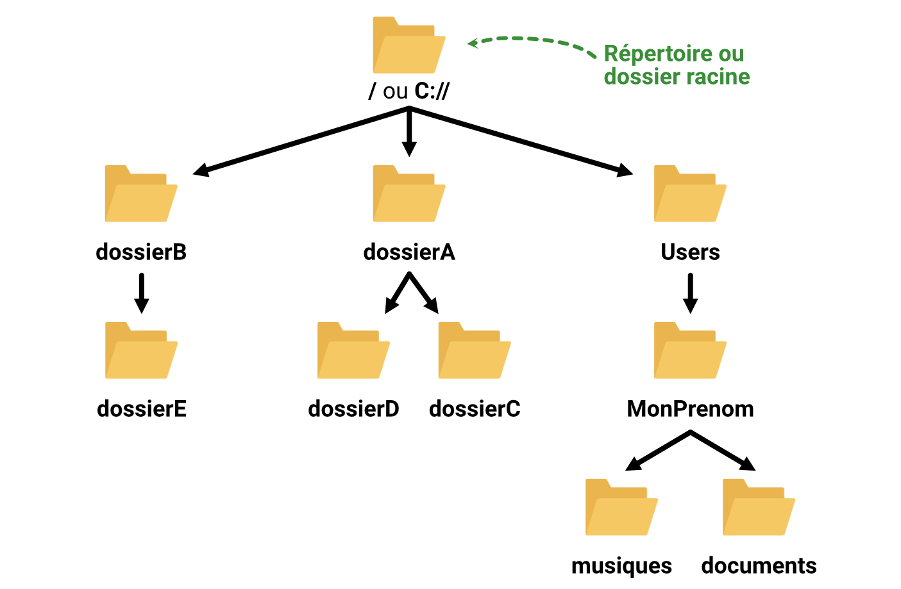

# Sommaire 
- [Sommaire](#sommaire)
- [Avant de lancer son premier programme](#avant-de-lancer-son-premier-programme)
- [Différence entre les languages compilés et interprétés](#différence-entre-les-languages-compilés-et-interprétés)
- [Les logiciels pour créer des programmes C++](#les-logiciels-pour-créer-des-programmes-c)
  - [Utiliser un éditeur de texte et un compilateur (recommandé pour apprendre)](#utiliser-un-éditeur-de-texte-et-un-compilateur-recommandé-pour-apprendre)
  - [Utiliser un IDE](#utiliser-un-ide)
- [Pourquoi je ne recommande pas l'usage d'un IDE pour apprendre à programmer](#pourquoi-je-ne-recommande-pas-lusage-dun-ide-pour-apprendre-à-programmer)
- [Installer un compilateur](#installer-un-compilateur)
  - [Sur Windows](#sur-windows)
  - [Sur Mac OS](#sur-mac-os)
  - [Sur Linux (Ubuntu)](#sur-linux-ubuntu)
- [Vous déplacer dans l'arborescence de vos fichiers](#vous-déplacer-dans-larborescence-de-vos-fichiers)
  - [Qu'est-ce qu'un chemin ?](#quest-ce-quun-chemin-)
  - [Chemin relatif versus chemin absolu](#chemin-relatif-versus-chemin-absolu)
- [Compiler votre premier fichier](#compiler-votre-premier-fichier)
- [Terminologie](#terminologie)


# Avant de lancer son premier programme

<p align="justify"> 
Dans le book-0, vous avez appris à créer un fichier texte contenant votre code c++. Dans ce book, nous allons apprendre à exécuter un programme à partir d'un code C++. Nous verrons notamment comment compiler un fichier C++, étape indispensable avant d'exécuter le programme résultant. Comme d'habitude, différentes notions sont introduites avant de passer à la pratique. Si vous bloquez sur ces notions, n'hésitez pas à passer à la partie suivante, vous comprendrez certains concepts à force de pratique. Ayez confiance en la puissance d'apprentissage de votre cerveau. 😊
</p>

# Différence entre les languages compilés et interprétés

<p align="justify"> 
Pour écrire un programme, il est nécessaire de suivre un langage de programmation qui est constitué de mots clefs, de règles syntaxiques etc. Parmi les langages de programmation, nous pouvons identifier deux types principaux : 
</p>

- **Le language compilé (e.g. c++) :** le code est d'abord compilé/transformé en langage machine, un fichier binaire que votre machine peut exécuter.
- **Le langage interprété (e.g. python) :** le code est lu ligne par ligne par un interpréteur qui transforme "à la volée" votre code en langage machine.


<p align="justify"> 
Dans les <it>books</it> que vous êtes en train de lire, vous allez apprendre à programmer en C++, un langage compilé. Ainsi, pour créer un programme et l'exécuter, vous devez passer par l'étape de développement, que nous pouvons nommer codage ou encore programmation, de compilation puis d'exécution. 
</p>


# Les logiciels pour créer des programmes C++

<p align="justify"> 
Pour compiler un projet, c'est à dire un ensemble de fichiers formant un programme, nous pouvons identifier deux méthodes. La première consiste à utiliser un éditeur de texte, à enregistrer vos fichiers au format c++ et à les compiler à l'aide d'un compilateur. Le second consiste à utiliser ce que nous nommons un IDE (Integrated Development Environment). Les deux méthodes sont présentées ci-après. Aussi, il y est expliqué pourquoi nous allons utiliser la première.
</p>


## Utiliser un éditeur de texte et un compilateur (recommandé pour apprendre)

<p align="justify"> 
Pour créer des programmes, un éditeur de texte et un compilateur suffisent amplement, surtout pour des petits projets. Pour des raisons pédagogiques, je vous conseille fortement d'utiliser cette approche pour coder vos premiers programme. Utiliser ces deux outils vous permettra de voir la chaine complète de programmation à savoir : écrire votre code, le compiler et l'exécuter. Certains éditeurs de textes offrent aussi une coloration syntaxique et des aides pour l'écriture du code, pour vous simplifier la vie. Je vous conseille cependant d'utiliser l'éditeur le plus simple possible pour commencer : moins l'éditeur de texte vous simplifie la vie, mieux vous apprendrez les bases de la programmation. 
</p>


<p align="justify"> 
Ci-dessous, vous trouverez quelques recommandations d'éditeurs de texte : 
</p>

- **Bloc-note pour Windows :** est l'éditeur de texte le plus simple que vous pouvez trouver. Il est celui avec lequel j'ai commencé personnellement. Je le trouve bien car il n'est pas possible d'observer d'effets de bords. Rien n'est automatisé, vous n'avez pas de coloration syntaxique, ni d'auto-complétion, ni d'autres programme qui modifie automatiquement votre code sans que vous ne l'ayez demandé. Je vous conseille d'utiliser le bloc-note pour vos tous premier programme.  
- **TextEdit pour MacOS :** tout comme le bloc-note pour Windows, il est parfait pour commencer à apprendre à programmer. Pensez bien à aller dans TextEdit -> Réglages et à cocher dans *format* la case "Format texte" pour pouvoir écrire des fichiers texte. Une fois la case cochée, il vous faudra créer un nouveau fichier.
- **Geany pour Linux :** tout comme le bloc-note et TextEdit, je vous conseille fortement d'utiliser Geany pour écrire vos premiers programmes C++. Geany est un simple éditeur de texte qui vous évitera certains effets de bords qui pourraient complexifier votre apprentissage.
- **Notepad++ :[site officiel](https://notepad-plus-plus.org/downloads/)** est un peu plus évolué que les trois précédents logiciels. Il propose notamment la coloration syntaxique. Ce fut le deuxième logiciel que j'ai utilisé, une fois que je maîtrisais un peu la programmation. Il rendra vos sessions de code un peu plus agréable.  
- **Visual Studio Code : [site officiel](https://code.visualstudio.com)** est un éditeur de texte auquel il est possible d'ajouter des modules. Une fois que vous aurez bien pris en main le bloc-note puis notepad++, je vous recommande vivement d'utiliser ce logiciel qui vous permettra de coder dans n'importe quel langage, au cas où vous appreniez d'autres langages de programmation en parallèle. De plus, vous pourrez ajouter petit à petit des modules qui vous aideront à coder.
 


## Utiliser un IDE

<p align="justify"> 
Comme énoncé plus tôt, un IDE est un *Integrated Development Environment*, en français, un environement de développement « intégré » (EDI). L'objectif de ces logiciels est de faciliter la vie du développement. Ainsi, tous les outils dont ils a besoin sont réunis dans un seul et même programme. Ainsi, vous trouverez dans un IDE des outils de *profiling*, *debugging*, *versioning*, etc. Vous y trouverez bien sûr aussi un éditeur de texte avec de la coloration syntaxique et des aides écrire votre code, notamment ce que nous nommons l'auto-complétion.
</p>


<p align="justify"> 
Si vous êtes curieux et que vous souhaitez découvrir des IDE, voici une petite liste d'exemples non exhaustive :
</p>

- **Visual Studio : ([site officiel](https://visualstudio.microsoft.com/fr/))** Est adapté pour coder en C++ ou C# (et en d'autres langages). 
- **Visual Studio Code : ([site officiel](https://code.visualstudio.com))** Il peut être vu comme un IDE mais il est généralement considéré comme un éditeur de texte modulable. 
- **CLion : ([site officiel](https://www.jetbrains.com/fr-fr/clion/))** La gamme d'IDE de JetBrains permet de coder dans de nombreux langages. Leur programme CLion est spécialisé dans la programmation en C++. 


# Pourquoi je ne recommande pas l'usage d'un IDE pour apprendre à programmer

<p align="justify"> 
Les IDE sont très utiles pour les programmeurs/codeurs. Ils leur font gagner du temps et rendent leur travail plus fluide et agréable. CEPENDANT, les IDE cachent énormément de mécanismes à l'utilisateur. Notamment, en C++, les étapes de compilation et d'exécution sont complètement opaques – ou du moins difficiles d'accès pour les néophytes. Si vous apprenez à programmer avec un IDE, vous allez passer à côté de nombreux concepts de bases et vous vous sentirez impuissants face à certaines erreurs que vous rencontrerez. Je ne vous conseille donc pas d'utiliser un IDE pour apprendre à programmer. Les projets de ce *book* et des prochains seront réalisés avec un éditeur de texte et un compilateur.
</p>


# Installer un compilateur

<p align="justify"> 
Pour compiler un fichier C++, vous devez utiliser un compilateur. La démarche d'installation d'un compilateur vous est présenté dans les sous-parties suivantes pour les OS Windows, Mac OS, et Linux (Ubuntu).
</p>

## Sur Windows
Sur Windows, il est possible de compiler des fichiers c++ grâce au logiciel MINGW. Une version téléchargeable est disponbile sur sourceforge, [cliquez ici pour accéder à la page de téléchargement](https://sourceforge.net/projects/mingw/). Une fois l'exécutable téléchargé, lancez-le et suivez ses instructions pour installer le compilateur. Pensez à vous remémorer le chemin d'installation. Par défaut, MINGW est installé dans 
TODO: Expliquer comment ajouter le bin de mingw dans la variable PATH

## Sur Mac OS 

Sur mac, il vous est possible d'installer la commande "gcc". Pour cela, je vous propose d'utiliser homebrew, un gestionnaire de paquets, qui vous facilitera la tâche. 

Pour installer homebrew, lancez le programme "Terminal" en appuyant sur ⌘+espace et en cherchant le programme "Terminal". Une fois le terminal ouvert, vous pourrez y entrer des lignes de commande. Si vous n'êtes pas habitués à ce principe, copiez et collez bêtement la ligne suivante et appuyez sur entrer pour lancer la commande.

```
/bin/bash -c "$(curl -fsSL https://raw.githubusercontent.com/Homebrew/install/HEAD/install.sh)"
```


Attention : Il est possible que les lignes précédentes ne soient pas très à jour et ne fonctionnent pas correctement. Si tel est le cas, je vous propose d'aller sur le [site officiel de homebrew](https://brew.sh/index_fr) pour l'installer.


Si aucune erreur n'est notifiée par le terminal, réalisez le même processus avec la ligne suivante en la copiant puis la collant dans le terminal et en appuyant finalement sur entrer. Cette ligne de commande va installer la commande gcc – et d'autres outils dont vous n'aurez pour le moment pas l'utilité.

```
brew install gcc
```

Maintenant que votre compilateur est installé, nous allons pouvoir transformer vos fichiers c++ en des programmes exécutables par votre machine.


## Sur Linux (Ubuntu)
Dans ces *books*, nous partons du principe que les lecteurs utilisant Linux sont sous la distribution Ubuntu. Les tâches à exécuter sont généralement les mêmes (ou très légèrement différentes) d'une distribution à une autre. Si vous rencontrez des difficultés, n'hésitez pas à créer un *issue*.

Pour installer gcc, vous devrez ouvrir votre terminal. Le terminal est trouvable dans la liste des programmes ou dans la barre de recherche si vous en avez une sur votre système d'exploitation. Une fois ouvert, vous pourrez lancer les commandes suivantes dans votre terminal. Pour lancer une commande, il faut la copier ou l'écrire dans votre terminal et appuyer sur entrer. Je vous invite à lancer les commandes les unes après les autres.

```
sudo apt update
sudo apt install build-essential
```

Maintenant que votre compilateur est installé, nous allons pouvoir transformer vos fichiers c++ en des programmes exécutables par votre machine.


# Vous déplacer dans l'arborescence de vos fichiers
Pour compiler un fichier, il vous est nécessaire d'indiquer son chemin. Dans votre ordinateur, les fichiers sont organisés en arborescence. Un dossier peut contenir d'autres dossiers et des fichiers. Comme illustré ci-dessous, l'organisation des dossiers peut être vu comme un arbre. Sur Linux et Mac OS, le dossier dit "racine", est le premier dossier, contenu par aucun autre dossier et se nomme "/". Pour Windows, il existe un dossier racine par disque monté et sont nommés avec la lettre associée au disque. Par exemple, "C://", "D://", "E://" etc. 


<p align="center"></p>


Si vous avez utilisé un ordinateur sur Windows, vous vous êtes certainement déjà servi de ce que nous (les informaticiens) nommons un explorateur de fichiers. Ce programme, présent nativement sur Windows, vous permet de naviguer dans l'arborescence de vos fichiers. 


Dans cette section, nous vous présenterons tous les concepts  nous présentons ce qu'est une arborescence, un chemin, nous présenterons la différence entre un chemin relatif et un chemin absolu et nous vous apprendrons à vous déplacer sur votre machine via le terminal, qu'elle soit sur Windows, Mac ou Linux.

Dans cette section, nous allons vous apprendre à vous déplacer dans l'arborescence de vos fichiers. 


## Qu'est-ce qu'un chemin ?
Le chemin d'un fichier indique son positionnement dans la machine (ordinateur, serveur) que vous utilisez. Grâce au chemin d'un fichier, vous pouvez indiquer comment y accéder pour le lire, le modifier ou l'exécuter.

## Chemin relatif versus chemin absolu


# Compiler votre premier fichier


Structure à utiliser
```
gcc [nom du fichier]
```


Par exemple : 
```
gcc monfichier.cpp
```

Par défaut, gcc va nommer l'exécutable généré "a.out". Cependant, il vous est possible de lui fournir le nom que vous souhaitez donner à l'exécutable généré en suivant la structure suivante : 
```
gcc [nom du fichier] -o [nom de l'exécutable]
```

Exemple : 
```
gcc monfichier.cpp -o monexecutable
```

Ajoutez un .exe sur windows à la fin de votre fichier.
```
gcc monfichier.cpp -o monexecutable.exe
```

Ne vous préoccupez pas des détails pour le moment. Vous vous posez certainement des questions telles que "pourquoi -o ?" ou "est-ce que je peux déplacer le -o et le mettre n'importe où ?". Je vous invite à vous amusez avec la commande si vous êtes curieux 


# Terminologie
- Langage de programmation : 
- Language compilé : 
- Language interprété : 
- Compilateur : 
- Interpréteur : 