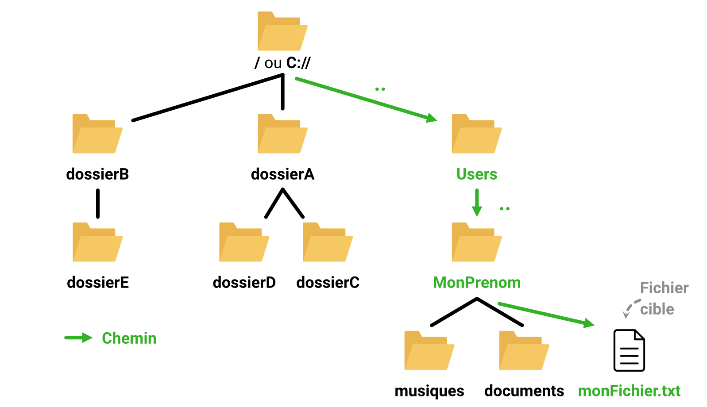

# Sommaire 
- [Sommaire](#sommaire)
- [Vous déplacer dans l'arborescence de vos fichiers](#vous-déplacer-dans-larborescence-de-vos-fichiers)
- [Qu'est-ce qu'un chemin ?](#quest-ce-quun-chemin-)
  - [Chemin absolu](#chemin-absolu)
  - [Chemin relatif](#chemin-relatif)
  - [Les dossiers courants et parents](#les-dossiers-courants-et-parents)
  - [Le chemin d'un fichier](#le-chemin-dun-fichier)
- [Qu'est-ce qu'un terminal ?](#quest-ce-quun-terminal-)
- [Entrez votre première commande dans un terminal](#entrez-votre-première-commande-dans-un-terminal)
  - [Windows](#windows)
  - [Linux](#linux)
  - [Mac OS](#mac-os)
- [Vous déplacer dans un terminal](#vous-déplacer-dans-un-terminal)


# Vous déplacer dans l'arborescence de vos fichiers

<p align="justify"> 
Pour compiler un fichier, il vous est nécessaire d'indiquer son chemin. Dans votre ordinateur, les fichiers sont organisés en arborescence. Un dossier peut contenir d'autres dossiers et des fichiers. Comme illustré ci-dessous, l'organisation des dossiers peut être vu comme un arbre. Sur Linux et Mac OS, le dossier dit "racine", est le premier dossier, contenu par aucun autre dossier et se nomme "/". Pour Windows, il existe un dossier racine par disque monté et sont nommés avec la lettre associée au disque. Par exemple, "C://", "D://", "E://" etc. 
</p>


<p align="center"></p>


<p align="justify"> 
Si vous avez utilisé un ordinateur sur Windows, vous vous êtes certainement déjà servi de ce que nous (les informaticiens) nommons un explorateur de fichiers. Le même type de logiciel est présent sur mac et dans la plus part des distributions linux modernes. Ce programme, présent nativement sur Windows, vous permet de naviguer dans l'arborescence de vos fichiers.
</p> 


<p align="justify">
Pour apprendre à vous déplacer dans les dossiers de votre ordinateur, nous aborderons dans cette sections les concepts d'arborescence et de chemin. De plus, nous introduirons aussi le terminal – ou invité de commande – pour vous apprendre à vous déplacer dans votre ordinateur grâce à des commandes. Ces connaissances et compétences vont seront d'une grande aide pour compiler vos projets de programmation mais également pour réaliser une très grand nombre, si ce n'est toutes, de tâches informatiques.
</p>


# Qu'est-ce qu'un chemin ?

<p align="justify">
Le chemin d'un fichier (ou dossier) indique son positionnement dans la machine (ordinateur, serveur) que vous utilisez. Grâce au chemin d'un fichier, vous pouvez indiquer comment y accéder pour le lire, le modifier ou l'exécuter. Nous identifions deux types de chemins que nous allons présenter ci-après, les chemins absolus et les chemins relatifs.
</p>


## Chemin absolu

<p align="justify">
Le chemin absolu indique les dossiers à empreinter depuis le dossier racine pour atteindre le dossier ou fichier cible. L'image ci-après illustre une arborescence de dossiers. Le chemin absolu vers le dossier musiques est dessiné en vert. Ce chemin s'écrit de la manière suivante sous Mac OS et Linux : 
</p>

```
/Users/MonPrenom/musiques
```

<p align="justify">
Sur Windows, les chemins absolus s'écrivent légèrement différemment. Les fichiers ne sont pas séparés par des slashs mais par des antislashs (\). De plus, le dossier racine est la lettre de l'un de vos disques tel que "C:\".
</p>

```
C:\Users\MonPrenom\musiques
```

<p align="center"></p>

## Chemin relatif

<p align="justify"> 
Le chemin relatif indique les dossiers à empreinte depuis le dossier courant – le dossier dans lequel vous vous trouvez – pour atteindre le dossier ou le fichier cible. Autrement dit, ce chemin est relatif au dossier courant. La figure ci-après illustre le chemin relatif faisant référence au dossier musiques lorsque vous vous trouvez dans le dossier Users. Le chemin s'écrit de la manière suivante : 
</p>

```
Users/MonPrenom/musiques
```

<p align="center"></p>


## Les dossiers courants et parents

<p align="justify"> 
Quelque soit le système d'application. TOUS les dossiers contient chacun à minima deux dossiers :
</p>


- **Le dossier courant :** il s'écrit **"."**. Le chemin relatif "./test" est un exemple de chemin relatif utilisant ce dossier.
- **Le dossier parent :** il s'écrit **".."**. Le chemin relatif "../test" est un exemple de chemin relatif utilisant ce dossier.


<p align="justify"> 
Autrement dit, le dossier courant est un dossier qui fait référence au dossier dans lequel vous vous trouvez tandis que le dossier parent est un dossier qui fait référence au dossier précédent le dossier dans lequel vous êtes. Ne vous inquiétez pas, le dossier courant peut paraître inutile. Vous découvrirez son utilité lorsque vous commencerez à bien maîtriser les programmes de vos systèmes d'exploitation. En attendant, ne cherchez pas à comprendre son utilité. Sachez simplement qu'il existe.
</p>


<p align="justify"> 
Dans la figure ci-dessous, un chemin impossible à décrire sans utiliser le dossier parent ".." est illustré en vert. 
</p>


<p align="center"></p>


<p align="justify"> 
Ce chemin démarre du dossier "MonPrenom" et atteind le dossier "dossierD". Pour atteindre ce dernier, il est d'abord nécessaire de se déplacer du dossier "MonPrenom" au dossier "Users" en utilisant la référence du dossier parent, "..". De la même manière, nous pouvons passer du dossier "Users" au dossier racine "/" ou "C://". Puis, comme nous l'avions déjà fait avec les chemins relatifs, il suffit de passer par dossierA et enfin nous pouvons atteindre dossierD. Voici le chemin relatif final que nous obtenons en suivant ces étapes : 
</p>


```
../../dossierA/dossierD
```


## Le chemin d'un fichier

<p align="justify"> 
Jusqu'à maintenant, les chemins que nous avons écrits ne ciblaient que des dossiers. Les chemins peuvent aussi cibler des fichiers. Imaginons que le dossier "MonPrenom" contienne un fichier texte nommé "monTexte.txt". Nous pouvons y faire référence avec un chemin absolu de la manière suivante : 
</p>


```
Linux et Mac OS : /Users/MonPrenom/monTexte.txt

Windows : C:\\Users\MonPrenom\monTexte.txt
```


<p align="justify"> 
Vous constatez donc que le principe est le même. Nous écrivons les noms des dossiers à empreinter que nous séparons par des "/" ou des "\" et enfin nous écrivons le nom du fichier cible.
</p>


<p align="justify"> 
La figure ci-dessous illustre ce chemin en vert : 
</p>


<p align="center"></p>


<p align="justify"> 
En utilisant le même principe, il est possible aussi de faire référence à des fichiers avec un chemin relatif. Exemple, vous vous trouvez dans le dossier "Users" et souhaitez accéder au fichier "monFichier.txt" en utilisant le chemin suivant : 
</p>

```
monPrenom/monFichier.txt
```


# Qu'est-ce qu'un terminal ?

<p align="justify"> 
Si vous êtes un ou une néophyte, vous avez déjà certainement utilisé un explorateur de fichier, notamment sur Windows, pour vous déplacer dans les dossiers de votre machine. Ci-dessous, vous trouverez une illustration d'un explorateur de fichiers que j'ai trouvé sur internet. Les éléments d'interface y sont décrits et nous ne reviendrons pas dessus dans ce document. Sachez juste que dans cette capture d'écran, l'utilisateur se trouve dans un dossier courant et l'explorateur de fichiers lui permet de se déplacer dans un dossier enfant ou de revenir au dossier parent (l'action "précédent").
</p>

<p align="center"></p>


<p align="justify">
Lorsque nous travaillons sur un ordinateur, ou que nous programmons, nous n'utilisons pas nécessairement l'explorateur de fichiers pour nous déplacer de dossiers en dossiers. Le <strong>terminal</strong> permet aussi de réaliser cette tâche. 
</p>


<p align="justify">
Le terminal est un petit logiciel qui ne fonctionne qu'avec du texte. Il vous permet d'entrer des commandes qui seront exécutés, comme des programmes, et qui réaliseront les tâches que vous demanderez : vous déplacer dans un dossier, supprimer ou créer un dossier/fichier, afficher le nombre de lignes d'un fichier texte, transformer un fichier mp3 en wav etc. Un terminal a généralement son propre langage de programmation que nous nommons interpréteur de commande. Grâce à cela, il est possible de réaliser des tâches complexes telles que trier tous vos fichiers .mp3 et .wav et les déplacer dans deux dossiers distincts pour les séparer sans que vous n'ayez aucun glisser/déposer ou copier/coller à réaliser vous-même. Tout sera automatisé en quelques lignes de code. Nous détaillerons plus tard le concept d'<strong>interpréteur</strong>. 
</p>

<p align="justify">
Ci-dessous vous trouverez un exemple de terminal. Généralement, le terminal vous indique le chemin du dossier courant, le dossier dans lequel vous vous trouvez à l'instant présent. Vous avez aussi d'autres informations qui sont affichées telles que votre nom d'utilisateur sur la machine voire le nom de la machine.
</p>

<p align="center"></p>

<p align="justify">
Le terminal ne peut afficher que du texte. Il ne peut pas dessiner pixel par pixel. Pour séparer différentes informations, le terminal utilise ce que nous nommons des séparateurs. Ces caractères servent à séparer deux informations. Dans l'exemple de l'illustration précédente, l'utilisateur est séparé du nom de la machine par un caractère "@". Le nom de la machine est séparé du chemin du dossier courant par le caractère ":". Enfin, le chemin du dossier courant est séparé de la commande que l'utilisateur, vous, entre par un caractère "$".
</p>


# Entrez votre première commande dans un terminal
Dans cette section, nous allons voir comment ouvrir un terminal et y lancer des commandes. Nous verrons ces étapes pour les différents OS que vous pouvez utiliser à savoir Windows, Linux et Mac OS.


## Windows
Pour ouvrir un terminal surwindows, suivez les étapes suivantes : 
- Appuyez sur le bouton Windows pour ouvrir la barre de recherche
- Recherchez terminal
- Appuyez sur entrer ou cliquez sur l'icone du terminal

Vous pouvez aussi appuyer sur windows+R et entrer le texte "cmd" dans la fenêtre qui s'affiche. Le terminal se lancera ensuite.

Une fois le terminal ouvert, je vous invite à rentrer en réalisant un copier coller les commandes suivantes. Elles seront des premiers exemples de ce que vous pouvez faire avec un terminal.

A noter : les commandes sont parfois un peu différentes sur windows et sur linux. Elles sont généralement les mêmes sur Linux et Mac OS. Dans la suite, des précisions vous seront données sur les commandes et les OS que vous pouvez utiliser.

## Linux 
Chercher le terminal dans votre barre de recherche et dans la liste de vos programmes et lancez-le. En général, vous pouvez aussi lancer un nouveau terminal avec le raccourci clavier ctrl+alt+T. 

Une fois le terminal ouvert, je vous invite à rentrer en réalisant un copier coller les commandes suivantes. Elles seront des premiers exemples de ce que vous pouvez faire avec un terminal.

A noter : les commandes sont parfois un peu différentes sur windows et sur linux. Elles sont généralement les mêmes sur Linux et Mac OS. Dans la suite, des précisions vous seront données sur les commandes et les OS que vous pouvez utiliser.

## Mac OS
Utilisez le raccourci ⌘+espace pour ouvrir spotlight. Une fois ouvert, cherchez puis lancez le "terminal". 

Une fois le terminal ouvert, je vous invite à rentrer en réalisant un copier coller les commandes suivantes. Elles seront des premiers exemples de ce que vous pouvez faire avec un terminal.

A noter : les commandes sont parfois un peu différentes sur windows et sur linux. Elles sont généralement les mêmes sur Linux et Mac OS. Dans la suite, des précisions vous seront données sur les commandes et les OS que vous pouvez utiliser.


# Vous déplacer dans un terminal

Comme nous l'avons vu plus tôt, le terminal vous indique dans quel dossier vous vous trouvez. Nous allons voir ci-après comment vous déplacer depuis votre terminal. Apprendre cela vous sera très utile pour compiler et exécuter des programmes en C++.

Sur Mac OS et sur Linux, vous pouvez utiliser la commande suivante pour vous déplacer dans un dossier enfant ou dans le dossier parent : 
```
cd [chemin du dossier cible]
```


Pour éviter d'avoir à écrire "change directory" à chaque commande, les développeurs de la commande ont préféré opter pour le diminutif "cd". 

Nous nommons "dossier courant" le dossier dans lequel vous vous trouvez dans un terminal ou dans l'explorateur de fichier. Pour vous aider à y voir plus clair, vous pouvez afficher les fichiers et dossiers présents dans votre dossier courant grâce à la commande suivante sur Linux et Mac OS : 
``` 
ls
```

Pour éviter d'avoir à écrire "list" à chaque commande, les développeurs ont cette fois-ci préféré opter pour le diminutif "ls". Vous pouvez aussi afficher le contenu d'un autre dossier : 
```
ls [chemin du dossier]
```

Sur Windows, le principe est le même mais le nom de la commande "dir". La structure est donc la suivante : 
```
dir [chemin du dossier]
```

Dans tout dossier, vous trouverez toujours deux sous-dossier, "." et "..". Le dossier "." fait référence au dossier courant. Le dossier ".." fait référence au dossier parent, le dossier précédent dans l'arborescence des fichiers. Par exemple, la commande `cd .` vous déplacera dans le dossier courant. D'une certaine manière, vous ne vous êtes donc pas déplacé en utilisant cette commande. Dans cet exemple, le sous-dossier "." n'a pas d'utilité mais il devient utile dans d'autres circonstances que vous rencontrerez plus tard. Plus intéressant à court terme, la commande `cd ..` vous permet de revenir dans le dossier parent. Je vous invite très fortement à la tester.

